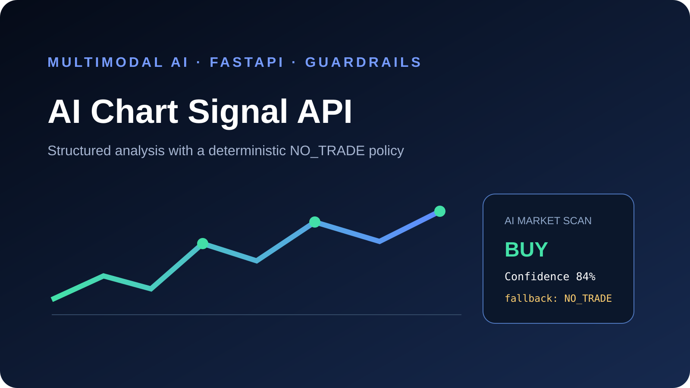

# AI Chart Signal API

[](https://github.com/hexedb/ai-chart-signal-api/actions)
[](https://python.org)
[](https://fastapi.tiangolo.com/)



A portfolio-ready MVP for the workflow **chart screenshot → multimodal analysis → validated trading signal**. The important engineering feature is not the model call; it is the guardrail layer that refuses weak, incomplete or internally inconsistent output.

> This repository is an engineering demonstration, not a trading system or financial advice. Demo mode produces deterministic sample output and makes no real market prediction.

## Product flow

```text
Mobile/web upload
       ↓
Vision provider (demo or OpenAI-compatible)
       ↓
Strict feature validation (scores 0..1, readable price levels)
       ↓
Decision policy (confidence + confirmations + level sanity checks)
       ↓
BUY / SELL / NO_TRADE structured JSON
```

## Features

- Raw image upload API without temporary disk files
- Pluggable vision-provider interface
- Offline deterministic demo provider
- OpenAI-compatible multimodal provider using JSON-only output
- Independent confirmation scoring
- Configurable confidence and confirmation thresholds
- Direction-aware entry/stop/target validation
- Risk/reward sanity limit
- Explicit `NO_TRADE` fallback
- Responsive single-page demo dashboard
- Unit tests for the decision boundary and provider validation

## Run locally

```bash
python -m venv .venv
source .venv/bin/activate  # Windows: .venv\Scripts\activate
pip install -e ".[dev]"
uvicorn chart_signal.api:app --reload
```

Open `http://localhost:8000` for the dashboard or `/docs` for Swagger UI.

The default `VISION_PROVIDER=demo` is fully offline. To enable a real provider:

```bash
export VISION_PROVIDER=openai
export OPENAI_API_KEY=...
export OPENAI_MODEL=gpt-4.1-mini
```

## API example

```bash
curl -X POST "http://localhost:8000/v1/analyze?symbol=XAUUSD&timeframe=H1" \
  -H "Content-Type: image/png" --data-binary @chart.png
```

Example response:

```json
{
  "symbol": "XAUUSD",
  "timeframe": "H1",
  "direction": "BUY",
  "confidence": 0.81,
  "confirmations": ["trend", "market_structure", "momentum"],
  "entry": 2384.2,
  "stop_loss": 2378.5,
  "take_profit": 2395.6,
  "risk_reward": 2.0,
  "explanation": "BUY setup passed 3 confirmations: trend, market_structure, momentum.",
  "disclaimer": "Research demo only. Not financial advice or a promise of performance."
}
```

## Why `NO_TRADE` is a first-class result

LLMs can return confident-looking but inconsistent values. The policy rejects a setup when:

- average confidence is below the threshold;
- too few independent confirmations pass;
- entry, stop and target are missing or ordered incorrectly;
- the proposed risk/reward exceeds the sanity limit;
- the provider explicitly reports no setup.

## Testing and evaluation

```bash
pytest -q
```

The included tests cover valid BUY/SELL results, low-confidence rejection, invalid price ordering, deterministic demo output and schema range validation. A production deployment should additionally use a labeled screenshot dataset, per-symbol calibration, false-positive tracking and human review before any consequential action.

## Mobile architecture

The API is designed for a React Native or Flutter client. A production app would add authentication, object storage, scan history, rate limits, encrypted secrets, observability and asynchronous processing for large images.

## License

MIT
